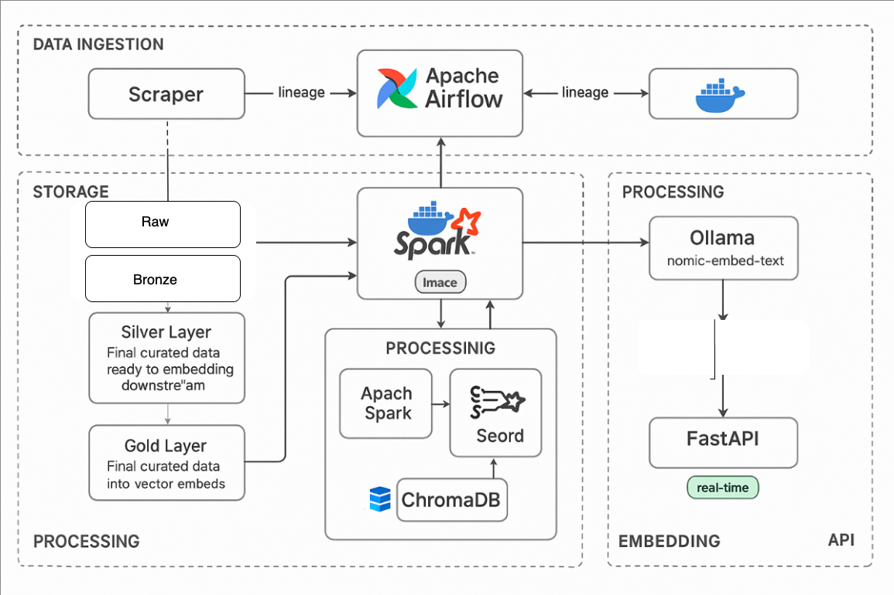

# 🚀 Makefile Commands for Docker Project

---
# 🧠 Data Lakehouse RAG Pipeline

This project implements an end-to-end **Data Scrape-to-RAG** (Retrieval-Augmented Generation) pipeline using a modern lakehouse architecture. It scrapes web content, stores it in Delta Lake (via MinIO), embeds documents using an Ollama model, indexes them in ChromaDB, and exposes a FastAPI-based RAG API.

All stages—from ingestion to embedding—are orchestrated by a single Airflow DAG: `data_pipeline_stage.py`.

---

## 🚀 Pipeline Overview

```
[Web Scraper] ──▶ [Delta Lake on MinIO] ──▶ [Spark Transformations]
       │                                 │
       └─────────────────────────────▶ [Ollama Embeddings + ChromaDB]
                                          │
                                   [FastAPI RAG Endpoint]
```

---

## 🛠️ Tech Stack

| Component     | Technology                        |
|---------------|------------------------------------|
| Orchestration | Apache Airflow                    |
| Storage       | MinIO + Delta Lake                |
| Processing    | Apache Spark                      |
| Embeddings    | Ollama (`nomic-embed-text`)       |
| Vector DB     | ChromaDB                          |
| API Server    | FastAPI                           |
| Containerization | Docker + Docker Compose        |

---

## 📁 Project Structure

```
.
├── airflow/
│   └── dags/
│       └── data_pipeline_stage.py     # End-to-end DAG
├── fastapi/                               # FastAPI RAG endpoint
├── .env                               # Environment variables
├── docker-compose.yml
├── requirements.txt
└── README.md
```

---

## ⚙️ Setup Instructions

### 1. Clone Repository

```bash
git clone https://github.com/rjldinesh/RAG-AI-Focused-Data-Infrastructure-Pipeline.git
```
This project uses a `Makefile` to simplify Docker operations. Make sure you have Docker and Docker Compose installed.

## 📦 Available Commands

| Command         | Description                                                                 |
|-----------------|-----------------------------------------------------------------------------|
| `make` or `make all`  | Runs the full reset process: clean, prune, build, and start containers. |
| `make clean`    | Stops and removes all containers, images, and associated volumes.          |
| `make prune`    | Removes all unused Docker data including volumes and networks.             |
| `make build`    | Rebuilds Docker images defined in `docker-compose.yml`.                    |
| `make up`       | Starts the Docker containers in detached mode (`-d`).                      |
| `make reset`    | Equivalent to running: `clean` → `prune` → `build` → `up`.                 |

## ✅ Usage

From the root of the project (where the `Makefile` is located), open your terminal and run:

```bash
make             # full reset: clean + prune + build + up
make clean       # stop and remove containers, images, and volumes
make prune       # prune unused Docker resources
make build       # rebuild all Docker images
make up          # start containers in detached mode

### 2. Add Environment Config


Create and populate `.env` file:

```
AWS_ACCESS_KEY_ID=ZPnglo5gVhmWx1iC0FdY
AWS_SECRET_ACCESS_KEY=OC2Ol37Mq7jflr4pcDp5H4vLYCGCUZrFMTUinWVK
MINIO_ENDPOINT=http://minio:9000
CHROMA_DB_PATH=/chroma/chroma
```


### 3. Start Services

```bash
docker-compose up --build
```

- **Airflow UI**: [http://localhost:8080](http://localhost:8080)
- **MinIO UI**: [http://localhost:9001](http://localhost:9001)
- **Spark Master UI**: [http://localhost:8082/](http://localhost:8082/)
- **FastAPI Docs**: [http://localhost:8005/docs](http://localhost:8005/docs)

---
## Architecture: 



## 🧠 DAG: `data_pipeline_stage.py`


This single DAG performs:

- ✅ Web scraping from RSS feeds and direct URLs  
- ✅ Parsing + storing raw data into Delta Lake (MinIO)  
- ✅ Bronze → Silver → Gold transformation with Spark  
- ✅ Document embedding with Ollama (`nomic-embed-text`)  
- ✅ Vector storage in ChromaDB  

Trigger it manually via Airflow UI 

# 🧬 Data Lineage

Data lineage is implicitly handled through structured DAG stages and Delta Lake's transaction logs. Here's how lineage is maintained:

- **Airflow DAG**: The `data_pipeline_stage.py` DAG explicitly sequences each step from scraping to embedding, enabling traceability.
- **Delta Lake**: Each transformation (Bronze → Silver → Gold) is written as a new Delta Lake transaction. This ensures:
  - Schema enforcement
  - Auditability via version history
  - Time travel for debugging
- **ChromaDB Metadata**: Embedded documents retain metadata linking back to their source URL, scraped timestamp, and stage.

Lineage can be visualized or traced through:
- Airflow's DAG UI (task-level trace)
- Delta Lake's versioning/logs (via Spark or DeltaTable APIs)
- Optional integration with tools like [OpenLineage](https://openlineage.io/) or [Marquez](https://marquezproject.ai/) for full observability.


---

## 🔍 Querying the API

After data is embedded and indexed, you can query the RAG endpoint:

```bash
curl -X POST http://localhost:8005/ask     -H "Content-Type: application/json"      -d '{"query": "Can you tell me about bbc tech news?"}'
```

---
## 🔗 Creating Spark Connection in Airflow UI

To connect Airflow to Spark for submitting jobs from the DAG:

1. **Access Airflow UI**: Visit [http://localhost:8080](http://localhost:8080)
2. **Navigate to Admin → Connections**
3. **Add a new Connection** with the following parameters:
    - **Conn Id**: `spark_submit_default`
    - **Conn Type**: `Spark`
    - **Host**: `spark://spark-master:7077` (or appropriate spark master URL)
    - **Extra**: *(Optional JSON settings)*


4. **Save the connection** and test via your DAG or CLI.

Ensure your Spark and Airflow containers are on the same Docker network (if using `docker-compose`) for smooth communication.

## ⚙️ GitHub CI/CD Integration

This project uses **GitHub Actions** to automate CI/CD tasks such as linting, testing, and deployment[Sample only].

### 🧪 Typical Workflow

1. **Push to `main` or `develop` branches**
3. **Latest code available in `develop` branche**
2. **Run CI jobs**:
   - Lint Python files with `flake8` or `ruff`
   - Run unit tests with `pytest`
   - Build Docker images (optional)

## 🧪 Dev Notes

- **MinIO** acts as S3-compatible Delta Lake backend  
- **Ollama** must have the `nomic-embed-text` model available locally  
- Ensure Airflow has access to both Spark and ChromaDB inside the container network  
- ChromaDB runs using local SQLite for now (can be scaled)

---

## 📘 To-Do 

- [ ] Add Pytest-based testing for endpoints and DAG logic  
- [ ] Add retry/error-handling stages  
- [ ] Add monitoring/logging enhancements 
- [ ] Marquez for better UI visualization  

---

## 📄 License

MIT License – see [LICENSE](LICENSE) for more.

---

## 🙌 Thanks to

- [Ollama](https://ollama.com)
- [ChromaDB](https://www.trychroma.com)
- [Apache Spark](https://spark.apache.org)
- [Delta Lake](https://delta.io)
- [Apache Airflow](https://airflow.apache.org)

#